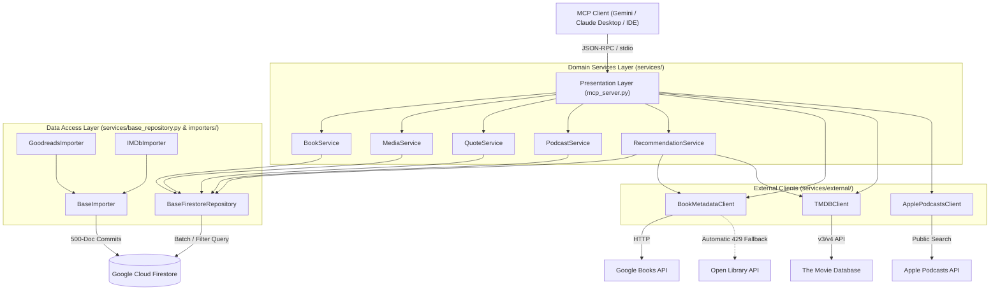

# Curator MCP (`curator-mcp`)

[](https://www.python.org/downloads/)
[](https://opensource.org/licenses/MIT)
[](https://github.com/jlowin/fastmcp)
[](https://cloud.google.com/firestore)
[](#-testing--quality-assurance)

A production-grade **Model Context Protocol (MCP)** server and automated data ingestion pipeline that transforms **Google Cloud Firestore** into your private, intelligent entertainment memory, literature companion, knowledge vault, and AI curator.

Connects natively to **Gemini**, **Claude Desktop**, **Antigravity IDE**, and other MCP-compliant agents, enabling natural language tracking and exploration across:
1. **Books**: Library ingestion, to-read queue, currently-reading tracking, Google Books & Open Library live discovery.
2. **Movies & TV**: IMDb ratings and watchlist ingestion, TMDB discovery, and automated similar-media recommendations.
3. **Memorable Quotes & Mental Models**: Capturing principles, philosophies, and memorable dialogue with theme tagging and spaced retrieval.
4. **Podcasts**: Queue management, listening logs, guest tracking, key takeaways, and zero-key Apple Podcasts discovery.
5. **Taste Profiling & Smart Recommendations**: Synthesizes ratings across books and films to recommend new gems while strictly filtering out items already consumed or queued.

---

## 🏛️ Clean Architecture & Design

`curator-mcp` is architected using **Domain-Driven Design (DDD)** and **Clean Architecture** principles. Rather than cramming business logic into a single file, the system is organized into modular, testable, and loosely-coupled components:



### Key Architectural Strengths:
- **Presentation Decoupling**: `mcp_server.py` acts as a thin controller exposing FastMCP tool endpoints that delegate directly to domain services.
- **Repository Pattern**: `BaseFirestoreRepository` encapsulates all Firestore CRUD and `FieldFilter` query operations.
- **Batch Processing**: `BaseImporter` implements safe 500-document batching chunks and dry-run simulation for CSV ingestion.
- **Resilient Fallbacks**: `BookMetadataClient` queries Google Books and transparently falls back to Open Library when rate limits (HTTP 429) occur.

---

## 📁 Repository Structure

```
curator-mcp/
├── .env.example                       # Environment configuration template
├── .gitignore                         # Strict protection for credentials, .env, and CSVs
├── pyproject.toml                     # Python dependencies & build metadata
├── README.md                          # Comprehensive documentation
├── config.py                          # Firebase Admin SDK & lazy Firestore singleton
├── models.py                          # Pydantic data schemas (Book, Media, Quote, Podcast)
├── mcp_server.py                      # FastMCP presentation layer (25 tools)
│
├── services/                          # Domain & Application Services
│   ├── __init__.py                    # Public domain service exports
│   ├── base_repository.py             # Generic Firestore Repository with CRUD & filtering
│   ├── book_service.py                # Book library, queues, and reading logs
│   ├── media_service.py               # Movies/TV, watchlists, and rating logs
│   ├── quote_service.py               # Memorable quotes, tags, and spaced retrieval
│   ├── podcast_service.py             # Podcast queues, takeaways, and listening logs
│   ├── recommendation_service.py      # Taste profiling & cross-collection deduplication
│   │
│   └── external/                      # External Third-Party API Clients
│       ├── __init__.py
│       ├── books_client.py            # Google Books + Open Library fallback client
│       ├── tmdb_client.py             # The Movie Database (TMDB) API client
│       └── podcasts_client.py         # Apple Podcasts API client (zero-key)
│
├── importers/                         # Ingestion Pipelines
│   ├── __init__.py
│   ├── base.py                        # Abstract BaseImporter with 500-doc chunking
│   ├── goodreads_importer.py          # Goodreads CSV ingestion pipeline
│   └── imdb_importer.py               # IMDb ratings & watchlist CSV ingestion pipeline
│
├── sample_data/                       # Safe, synthetic datasets for testing
│   ├── goodreads_sample.csv
│   ├── imdb_ratings_sample.csv
│   └── imdb_watchlist_sample.csv
│
└── tests/                             # Automated Test Suite (21 tests)
    ├── test_models_and_importers.py   # Schema validation & CSV parser tests
    ├── test_domain_services.py        # Domain services, OOP repositories, & client mocks
    ├── test_quotes_and_podcasts.py    # Quotes, podcasts, and metadata tests
    └── test_services.py               # External API fallback and error handling tests
```

---

## 🚀 Getting Started

### 1. Prerequisites
- **Python**: `3.10` or newer.
- **Google Cloud / Firebase Project**: With **Cloud Firestore** enabled in Native mode.
- **Firebase Service Account**: Downloaded JSON credentials key.

### 2. Installation

Clone the repository and set up a virtual environment:

```bash
git clone https://github.com/your-username/curator-mcp.git
cd curator-mcp

# Using python venv
python3 -m venv .venv
source .venv/bin/activate

# Install dependencies
pip install -e .
```

### 3. Firebase Service Account Configuration

1. In the [Firebase Console](https://console.firebase.google.com/), go to **Project Settings** > **Service accounts**.
2. Click **Generate new private key** and save the JSON file.
3. Move the file into your project directory (e.g. `service-account.json`).
4. Copy `.env.example` to `.env`:
   ```bash
   cp .env.example .env
   ```
5. Edit `.env`:
   ```ini
   FIREBASE_CREDENTIALS_PATH=./service-account.json
   
   # Optional: For movie & TV posters, overviews, and similar media recommendations
   TMDB_API_KEY=your_tmdb_api_key_here
   
   # Optional: For higher Google Books quota (basic search works without a key)
   GOOGLE_BOOKS_API_KEY=your_google_books_key_here
   ```

---

## 📥 Data Ingestion Pipelines

Import your existing personal libraries into Firestore using the batch importers.

### Goodreads Library Import
Export your library from **Goodreads** (`My Books` > `Import and Export` > `Export Library`):

```bash
# Preview records without writing (Dry Run)
python -m importers.goodreads_importer path/to/goodreads_library_export.csv --dry-run

# Execute batch write into Firestore 'books' collection
python -m importers.goodreads_importer path/to/goodreads_library_export.csv
```

### IMDb Ratings & Watchlist Import
Export your data from **IMDb** (`Your Activity` > `Ratings` > Export & `Your Watchlist` > Export):

```bash
# Ingest both ratings and watchlist simultaneously
python -m importers.imdb_importer \
  --ratings path/to/ratings.csv \
  --watchlist path/to/watchlist.csv

# Or ingest either file individually
python -m importers.imdb_importer --ratings path/to/ratings.csv
python -m importers.imdb_importer --watchlist path/to/watchlist.csv
```
*Note: If an item exists in both files, `imdb_importer` automatically marks it as `watched` with the user's rating taking precedence.*

---

## 🛠️ Model Context Protocol (MCP) Tools

The server registers **28 specialized tools** categorized across five domains:

### 1. Taste Profile, Curate My Night & Annual Wrapped
| Tool Name | Parameters | Description |
|---|---|---|
| `get_user_taste_profile` | *none* | Aggregates favorite genres, top directors, authors, and 5★/10★ items. |
| `get_entertainment_stats` | *none* | Macro metrics across books, media, quotes, and podcasts. |
| `get_smart_recommendations` | `category`, `limit` | Intelligent AI recommender that queries similar items and excludes consumed/queued titles. |
| `curate_for_tonight` | `max_runtime_mins`, `genre`, `min_imdb_rating`, `media_type`, `count` | Smart evening picker that filters watchlist by runtime, mood, and ratings with match reasons. |
| `generate_cultural_wrapped` | `year` | Comprehensive annual cultural retrospective with metrics and synthesized "Cultural Archetype". |

### 2. Books Management & Discovery
| Tool Name | Parameters | Description |
|---|---|---|
| `search_books` | `query`, `shelf`, `limit` | Search Firestore library by title or author keywords. |
| `get_recently_read_books` | `limit` | Retrieve finished books sorted chronologically by completion date. |
| `get_reading_list` | `shelf`, `limit` | Retrieve books from `to-read` or `currently-reading` queues. |
| `add_to_reading_list` | `title`, `author`, `notes` | Add a recommended book directly to the reading queue. |
| `log_read_book` | `title`, `author`, `user_rating`, `notes`, `date_read` | Log a finished book with 0–5 rating and notes. |
| `get_book_details` | `book_id` | Fetch complete document for a book by Goodreads ID. |
| `lookup_book_online` | `title`, `author` | Query Google Books & Open Library for synopses and covers. |
| `find_similar_books_online` | `title`, `author`, `limit` | Discover books similar in theme and author style. |

### 3. Media (Movies & TV) Management & Streaming
| Tool Name | Parameters | Description |
|---|---|---|
| `search_media` | `query`, `media_type`, `status`, `limit` | Search movies and series by title or director. |
| `get_recently_watched_media` | `limit`, `media_type` | Retrieve viewed movies/series sorted chronologically by rating date. |
| `get_watchlist` | `media_type`, `genre`, `limit` | Retrieve watchlist items with optional genre filter. |
| `add_to_watchlist` | `title`, `media_type`, `year`, `genres`, `directors`, `notes` | Add a movie or show to the watchlist. |
| `log_watched_media` | `title`, `media_type`, `user_rating`, `notes` | Log a viewed film/series with 1–10 rating. |
| `get_media_details` | `media_id` | Fetch complete record by IMDb Const ID (`tt...`). |
| `get_streaming_providers` | `title`, `media_type`, `country` | Check where a title is streaming (Netflix, Max, Prime, Apple TV+) via TMDB / JustWatch. |
| `lookup_media_online` | `title`, `media_type`, `year` | Query TMDB for synopsis, posters, and vote average. |
| `find_similar_media_online` | `title`, `media_type`, `limit` | Query TMDB recommendation algorithm for similar titles. |

### 4. Memorable Quotes & Mental Models
| Tool Name | Parameters | Description |
|---|---|---|
| `add_quote` | `quote_text`, `source_title`, `source_type`, `speaker_or_author`, `theme_tags`, `notes`, `favorite` | Save a quote or mental model from a book or film. |
| `get_random_quote` | `theme`, `source_type` | Spaced retrieval of a random quote for inspiration or decision-making. |
| `search_quotes` | `query`, `theme`, `source_title`, `limit` | Search saved quotes by keyword, speaker, or theme. |
| `list_favorite_quotes` | `limit` | Retrieve all quotes marked as all-time favorites. |

### 5. Podcasts
| Tool Name | Parameters | Description |
|---|---|---|
| `add_to_podcast_queue` | `podcast_name`, `episode_title`, `guest`, `topics`, `episode_url` | Add an episode to the listening queue. |
| `log_listened_podcast` | `podcast_name`, `episode_title`, `user_rating`, `guest`, `key_takeaways` | Log a completed episode with takeaways and rating. |
| `get_podcast_queue` | `limit` | View upcoming podcast episodes. |
| `search_podcasts` | `query`, `guest`, `topic`, `limit` | Search podcast archive by show, guest, or topic. |
| `lookup_podcast_online` | `query`, `limit` | Free online search via Apple Podcasts API for artwork and feeds. |

---

## 🔌 Connecting to MCP Clients

### Claude Desktop / Gemini / Antigravity IDE Configuration

Add the following configuration to your MCP config file (e.g. `claude_desktop_config.json` or `mcp_config.json`):

```json
{
  "mcpServers": {
    "curator-mcp": {
      "command": "/path/to/curator-mcp/.venv/bin/python",
      "args": [
        "/path/to/curator-mcp/mcp_server.py"
      ],
      "env": {
        "FIREBASE_CREDENTIALS_PATH": "/path/to/curator-mcp/service-account.json",
        "TMDB_API_KEY": "YOUR_TMDB_API_KEY_HERE"
      }
    }
  }
}
```

---

## 💬 Example Prompts to Ask Claude (Feature-by-Feature Guide)

Once Curator MCP is connected to **Claude Desktop**, you can interact naturally using prompts like these:

### 1. 🎁 Annual Retrospective & Taste Analysis
- *"Analyze my entertainment taste profile based on my books and movies."*
  - 👉 **Tool called**: `get_user_taste_profile`
- *"Generate my Curator Wrapped annual summary for 2026 and tell me what my Cultural Archetype is!"*
  - 👉 **Tool called**: `generate_cultural_wrapped(year=2026)`
- *"Give me a high-level breakdown of my stats across books, movies, quotes, and podcasts."*
  - 👉 **Tool called**: `get_entertainment_stats`

### 2. ⏱️ "Curate My Night" (Evening Movie Picker)
- *"I have 90 minutes tonight and want a great comedy or drama from my watchlist. Pick something for me."*
  - 👉 **Tool called**: `curate_for_tonight(max_runtime_mins=90, genre='Comedy')`
- *"What's a high-rated thriller on my watchlist that I should watch tonight?"*
  - 👉 **Tool called**: `curate_for_tonight(genre='Thriller', min_imdb_rating=8.0)`

### 3. 📺 "Where to Stream" (Streaming Availability)
- *"Where can I stream 'Inception' or 'The Philadelphia Story' right now in the US?"*
  - 👉 **Tool called**: `get_streaming_providers(title='Inception', country='US')`
- *"Is 'Interstellar' streaming on Netflix, Prime, or Max in the UK?"*
  - 👉 **Tool called**: `get_streaming_providers(title='Interstellar', country='GB')`

### 4. 🧠 Smart AI Recommendations (Library Deduplicated)
- *"Recommend 3 movies and 3 books based on my 10/10 and 5-star favorites that I haven't watched or read yet."*
  - 👉 **Tool called**: `get_smart_recommendations(category='all', limit=3)`
- *"Find books similar in themes and style to 'Thinking, Fast and Slow'."*
  - 👉 **Tool called**: `find_similar_books_online(title='Thinking, Fast and Slow')`
- *"Find movies similar to 'Blade Runner 2049'."*
  - 👉 **Tool called**: `find_similar_media_online(title='Blade Runner 2049')`

### 5. 🕒 Viewing & Reading History (Chronological)
- *"What was the last thing I watched and rated?"*
  - 👉 **Tool called**: `get_recently_watched_media(limit=5)`
- *"What was the last book I read and rated?"*
  - 👉 **Tool called**: `get_recently_read_books(limit=5)`
- *"I just finished watching 'Dune: Part Two'. Log it as watched, rate it 9/10, and add notes: 'Spectacular sound design'."*
  - 👉 **Tool called**: `log_watched_media(title='Dune: Part Two', user_rating=9, ...)`
- *"I just finished 'Atomic Habits' by James Clear. Log it as read with a 5/5 star rating."*
  - 👉 **Tool called**: `log_read_book(title='Atomic Habits', author='James Clear', user_rating=5)`

### 6. 📋 Active Queues & Watchlists
- *"What movies and series do I have on my watchlist?"*
  - 👉 **Tool called**: `get_watchlist(limit=10)`
- *"What books do I have on my to-read shelf?"*
  - 👉 **Tool called**: `get_reading_list(shelf='to-read')`
- *"Add 'Oppenheimer' to my movie watchlist."*
  - 👉 **Tool called**: `add_to_watchlist(title='Oppenheimer')`
- *"Add 'Project Hail Mary' by Andy Weir to my reading list."*
  - 👉 **Tool called**: `add_to_reading_list(title='Project Hail Mary', author='Andy Weir')`

### 7. 💬 Quotes & Mental Models
- *"Give me a random memorable quote from my database for inspiration today."*
  - 👉 **Tool called**: `get_random_quote`
- *"Save this quote from Fight Club: 'The things you own end up owning you.' Tag it with #consumerism and #freedom."*
  - 👉 **Tool called**: `add_quote(quote_text='...', source_title='Fight Club', theme_tags=['consumerism', 'freedom'])`
- *"Search my saved quotes for anything related to discipline or stoicism."*
  - 👉 **Tool called**: `search_quotes(query='discipline')`
- *"Show me my all-time favorite quotes."*
  - 👉 **Tool called**: `list_favorite_quotes`

### 8. 🎙️ Podcast Tracking & Online Discovery
- *"Queue up the Huberman Lab episode on dopamine to listen to later."*
  - 👉 **Tool called**: `add_to_podcast_queue(podcast_name='Huberman Lab', episode_title='Dopamine')`
- *"I just finished Lex Fridman #400 with Daniel Kahneman. Rate it 9/10 with key takeaway: 'System 1 vs System 2 thinking'."*
  - 👉 **Tool called**: `log_listened_podcast(podcast_name='Lex Fridman', ...)`
- *"Search online for podcast shows about neuroscience."*
  - 👉 **Tool called**: `lookup_podcast_online(query='neuroscience')`
- *"What episodes are currently in my podcast queue?"*
  - 👉 **Tool called**: `get_podcast_queue`

---

## 🔒 Security & Privacy Notice

This project is built for **public open-source publication** and adheres to strict security best practices:

1. **Zero Secret Leakage**:
   - The `.gitignore` strictly blocks all variations of credentials files (`service-account*.json`, `*firebase*.json`, `*credentials*.json`), environment files (`.env`), and personal user data (`*.csv`).
   - Only synthetic samples inside `sample_data/` are tracked by Git.
2. **Safe Lazy Loading**:
   - `config.py` uses lazy proxy initialization so that running unit tests, building wheels, or executing `--help` commands will never throw missing-key crashes or expose environment data.
3. **Audit Verification**:
   - The Git commit history has been audited to confirm no secrets, API tokens, or real user CSV files exist in any commit.

---

## 🧪 Testing & Quality Assurance

The codebase includes an automated unit test suite:

```bash
# Run all 24 unit tests
.venv/bin/python -m unittest discover -s tests
```

Tests cover:
- **Data Models**: Pydantic schema validation, shelf normalization, timestamp generation.
- **Importers**: Goodreads and IMDb CSV column mapping, Excel formatting cleanup, list field normalization.
- **Domain Services**: `BookService`, `MediaService`, `QuoteService`, `PodcastService`, `RecommendationService`.
- **External Clients**: Apple Podcasts API mocking, TMDB error resilience, and Google Books / Open Library HTTP fallbacks.

---

## 📄 License

Distributed under the **MIT License**. See `LICENSE` for details.
